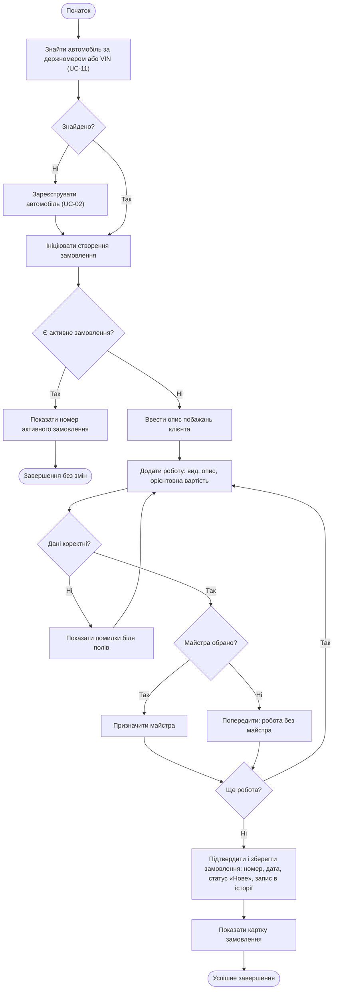

# Activity Diagram UC-03 «Оформити замовлення»

[← Назад: Варіанти використання](use-cases.md) | [Далі: Activity UC-04 →](activity-UC-04.md)

Діаграма показує послідовність дій, точки прийняття рішень та альтернативні завершення сценарію.

---

[← Назад: Варіанти використання](use-cases.md) | [Далі: Activity UC-04 →](activity-UC-04.md)
