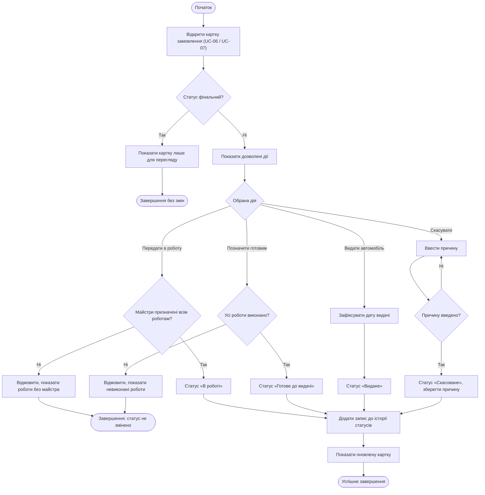

# Activity Diagram UC-04 «Змінити статус замовлення»

[← Назад: Activity UC-03](activity-UC-03.md) | [Далі: Activity UC-05 →](activity-UC-05.md)

Діаграма показує послідовність дій, точки прийняття рішень та альтернативні завершення сценарію.

---

[← Назад: Activity UC-03](activity-UC-03.md) | [Далі: Activity UC-05 →](activity-UC-05.md)
