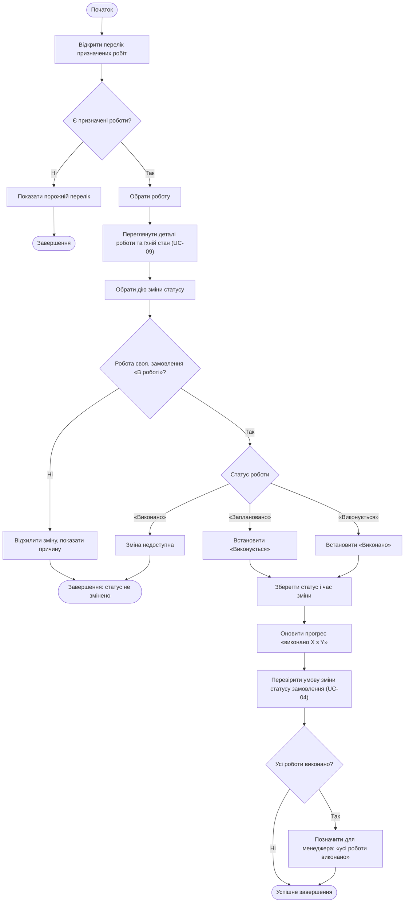

# Activity Diagram UC-05 «Виконати призначену роботу»

[← Назад: Activity UC-04](activity-UC-04.md)

Діаграма показує послідовність дій, точки прийняття рішень та альтернативні завершення сценарію.

---

[← Назад: Activity UC-04](activity-UC-04.md)
