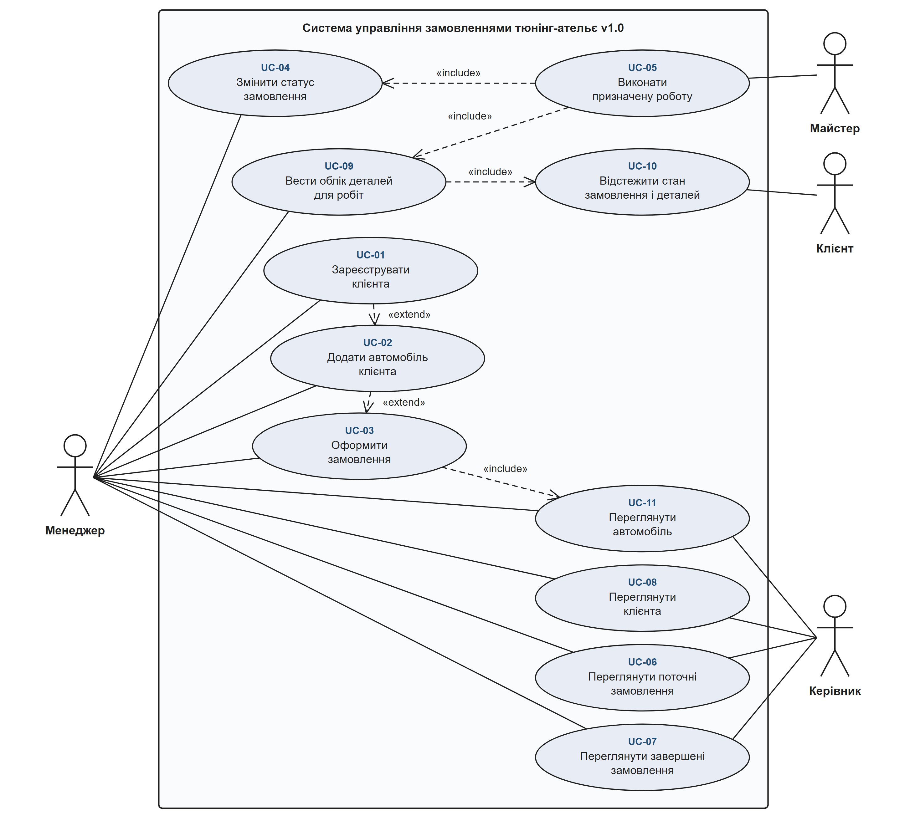
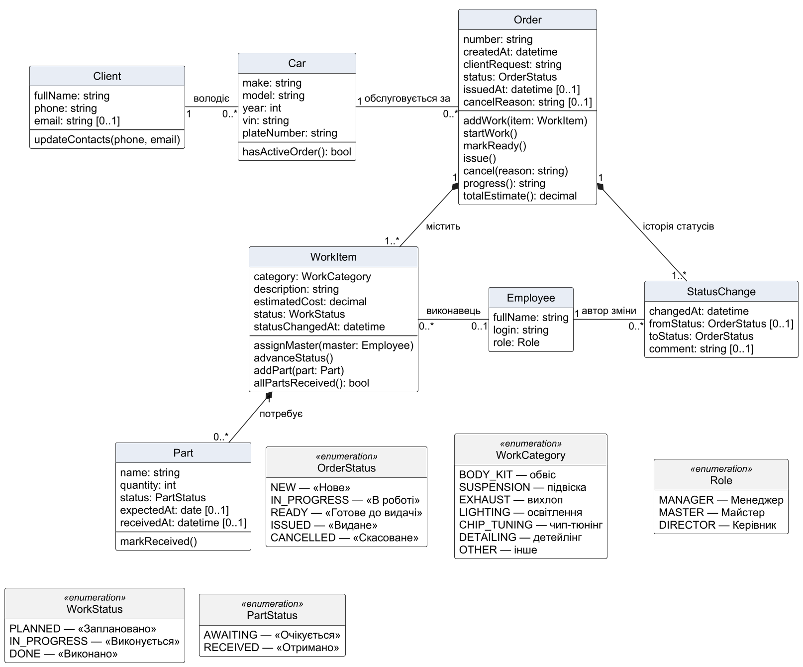
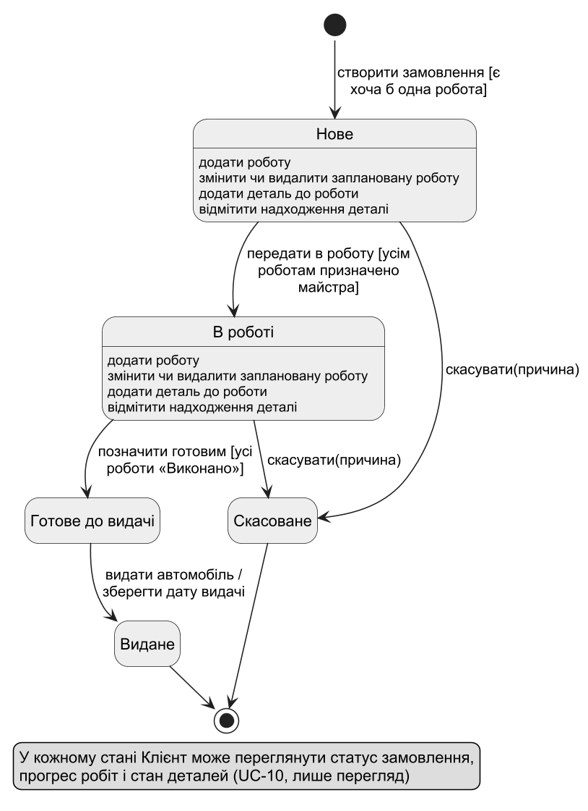

# Проєктування v1.0

[← Назад: Вимоги (SRS)](requirements.md) | [Далі: Матриця простежуваності →](traceability.md)

## Діаграма варіантів використання

Межа системи охоплює одинадцять варіантів використання, названих як цілі користувача. Менеджер веде клієнтів і автомобілі, оформлює замовлення та керує їхнім статусом; Майстер виконує призначені роботи; Керівник переглядає поточні й завершені замовлення, а також дані клієнтів і автомобілів. Менеджер також веде облік деталей для робіт (UC-09), а Клієнт є актором з єдиною ціллю — відстежити стан свого замовлення і деталей (UC-10); він нічого не змінює і не має облікового запису. Відношення «include» пов’язують UC-03 з UC-11, UC-05 з UC-09 і UC-04, UC-09 з UC-10; відношення «extend» — UC-01 з UC-02 і UC-02 з UC-03; їх пояснено у [Варіантах використання](use-cases.md).

## Діаграма класів

Client (клієнт) володіє нулем або більше Car (автомобіль); у Car може бути багато Order (замовлення), але не більше одного активного, що перевіряє операція hasActiveOrder(). Order композиційно містить щонайменше одну WorkItem (роботу) та історію змін статусу StatusChange, які не існують окремо від замовлення. WorkItem пов’язана з Employee (працівником із роллю «Майстер») з кратністю 0..1, бо робота може бути ще без майстра; StatusChange фіксує автора зміни. WorkItem композиційно містить нуль або більше Part (деталь): деталь має стан «Очікується» або «Отримано», очікувану дату й час фактичного надходження; allPartsReceived() показує, чи всі деталі роботи вже на місці. Окремого класу для перегляду клієнтом немає: Клієнт бачить те саме, що зберігають Order, WorkItem і Part, а замовлення знаходиться за Order.number і Client.phone.
Статуси замовлення й роботи, види робіт і ролі винесено в перелічення, назви значень яких збігаються з термінами SRS. Операції Order (startWork, markReady, issue, cancel) відповідають переходам State Machine Diagram. Технічні класи (контролери, репозиторії, DTO) і службові ідентифікатори на діаграмі не моделюються — вони з’являться під час реалізації в ЛР №4.

## Життєвий цикл замовлення

Пов’язані вимоги: FR-07, FR-09, FR-12, FR-13, FR-14, FR-20, FR-21; Use Case: UC-04, UC-05, UC-09, UC-10.

State Machine Diagram у v1.0 доречна для об’єкта Order, оскільки дозволені дії залежать від його стану: змінювати перелік робіт можна лише в станах «Нове» та «В роботі», майстер може відмічати роботи лише для замовлення «В роботі», скасувати можна лише до готовності, а видане чи скасоване замовлення змінювати не можна. Отже, статус є частиною предметних правил, а не довідковим атрибутом.
Діаграма містить п’ять станів: «Нове», «В роботі», «Готове до видачі» та два фінальні — «Видане» і «Скасоване». Сторожові умови переходів збігаються з вимогами: [усім роботам призначено майстра] — FR-09, [усі роботи «Виконано»] — FR-12; переходи в «Скасоване» — FR-14; видача з фіксацією дати — FR-13. Внутрішні дії станів «Нове» та «В роботі» відповідають FR-07 (роботи) і FR-20 (деталі). Надходження деталі не змінює стан замовлення, тому окремого стану «Очікує деталі» немає: стан деталей Клієнт бачить поруч зі статусом замовлення в будь-якому стані (FR-21).
Для WorkItem окрема діаграма станів не будується: її життєвий цикл лінійний («Заплановано» → «Виконується» → «Виконано») без розгалужень і повернень, а єдине правило, що залежить від стану, — редагувати можна лише заплановану роботу — вже зафіксоване у FR-07, FR-11 та на Activity Diagram UC-05. Окрема діаграма не дала б нової інформації.

## Індивідуальні Activity Diagram

- [UC-03 «Оформити замовлення»](activity-UC-03.md)
- [UC-04 «Змінити статус замовлення»](activity-UC-04.md)
- [UC-05 «Виконати призначену роботу»](activity-UC-05.md)

---

[← Назад: Вимоги (SRS)](requirements.md) | [Далі: Матриця простежуваності →](traceability.md)
